# Architecture — Plateforme de diffusion vidéo MAP

> Document d'architecture technique de la plateforme interne de gestion et de diffusion
> de contenus vidéo de la **MAP (Maghreb Arabe Presse)**. Solution **entièrement
> auto-hébergée** : téléversement, transcodage, stockage objet et diffusion **HLS**, sans
> aucun service externe (pas de YouTube/Vimeo, pas de cloud public, pas de CDN tiers).

**Sommaire**

1. [Vue d'ensemble](#1-vue-densemble)
2. [Composants applicatifs](#2-composants-applicatifs)
3. [Modèle de données](#3-modèle-de-données)
4. [Téléversement (upload chunké)](#4-téléversement-upload-chunké)
5. [Encodeur vidéo & pipeline de transcodage](#5-encodeur-vidéo--pipeline-de-transcodage)
6. [Streaming HLS](#6-streaming-hls)
7. [Cycle de vie d'une vidéo (transversal)](#7-cycle-de-vie-dune-vidéo-transversal)
8. [Commentaires & likes (engagement)](#8-commentaires--likes-engagement)
9. [Accès : Admin, Éditeur, Visiteur](#9-accès--admin-éditeur-visiteur)
10. [Déploiement](#10-déploiement)
11. [Annexe — référence des endpoints](#11-annexe--référence-des-endpoints)

> **Note de lecture.** Les figures sont écrites en **Mermaid** : elles se rendent
> automatiquement sur GitHub, dans VS Code (extension *Markdown Preview Mermaid*) et la
> plupart des visualiseurs Markdown.

---

## 1. Vue d'ensemble

La plateforme est une application web **client/serveur** découplée :

- un **frontend Angular** (SPA) qui ne contient aucune logique métier sensible ;
- une **API REST** ASP.NET Core qui porte toute la logique, la sécurité et l'accès aux données ;
- des **services d'infrastructure auto-hébergés** : PostgreSQL (données), MinIO (objets/vidéos),
  Hangfire + FFmpeg (traitement asynchrone), Nginx (frontal).

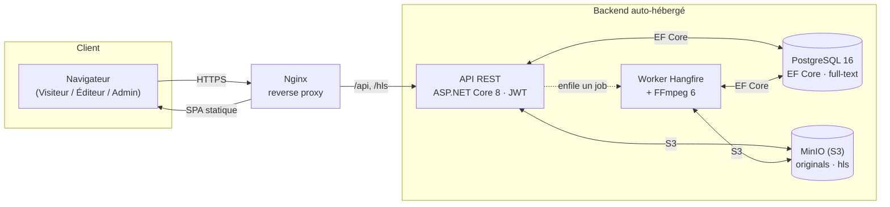

**Principes directeurs**

| Principe | Mise en œuvre |
|---|---|
| Auto-hébergement total | Aucune dépendance externe ; toute brique tourne sur l'infrastructure MAP. |
| Séparation des responsabilités | Découpage backend Domain / Application / Infrastructure / Api. |
| Sécurité par rôle | ASP.NET Core Identity (hash), JWT Bearer, RBAC (`[Authorize(Roles=…)]`). |
| Traitement asynchrone | Le transcodage (lourd) est déporté dans une file Hangfire + worker FFmpeg. |
| Diffusion adaptative | HLS multi-débit (360p/720p/1080p) servi via un proxy contrôlé. |
| Internationalisation | Interface bilingue FR/AR avec mise en page **RTL**. |

---

## 2. Composants applicatifs

### 2.1 Carte des composants

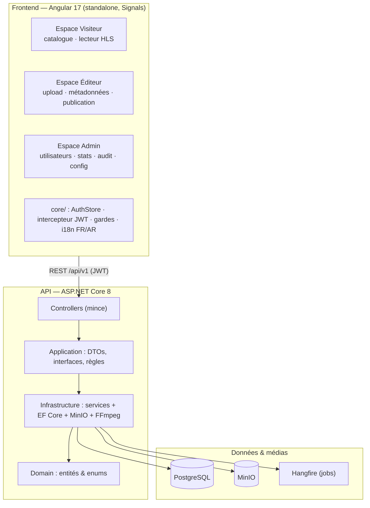

### 2.2 Frontend (Angular)

Application **standalone** (sans NgModules), état applicatif via **Signals**, style **Tailwind**
(thème « Newsroom » : bleu encre + rouge MAP). Trois espaces distincts, chargés en *lazy* :

- **`core/`** — `AuthStore` (jeton JWT + utilisateur + rôles, persistance `localStorage`),
  **intercepteur HTTP** (ajoute `Authorization: Bearer`, déconnecte sur `401`), **gardes**
  (`authGuard`, `editorGuard`, `adminGuard`), **i18n** maison (service Signals + pipe `| t`,
  bascule FR/AR + `dir="rtl"`).
- **`shared/ui/`** — composants réutilisables (badge de statut, pagination, barre de recherche,
  vignette vidéo, spinner…).
- **`features/`** — `public` (catalogue, détail + lecteur), `editor` (tableau de bord, upload,
  édition), `auth` (login/register), `admin` (stats, utilisateurs, catégories, audit, config).
- **`layouts/`** — `PublicShell` (barre haute), `EditorShell` et `AdminShell` (barres latérales).

| Espace public (FR, LTR) | Espace public (AR, RTL) |
|---|---|
| 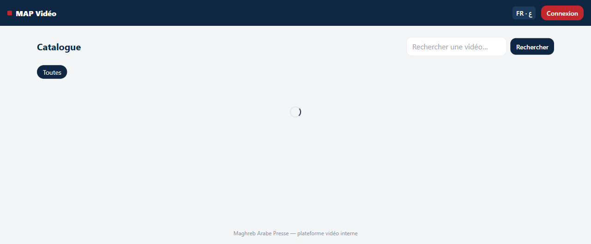 | 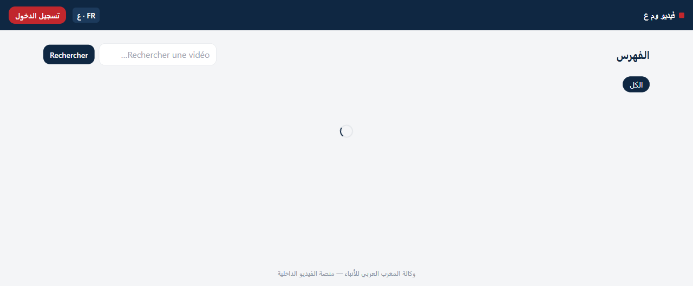 |

### 2.3 Reverse proxy (Nginx)

Point d'entrée unique. Sert la SPA, route `/api/*` vers l'API et `/hls/*` vers le proxy de
diffusion. Permet de masquer la topologie interne et de centraliser TLS/compression.

### 2.4 API ASP.NET Core — couches

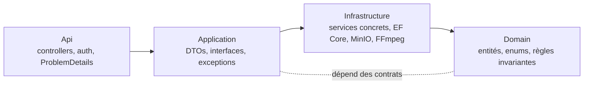

- **Domain** — entités (`Video`, `User`, `Comment`, `Like`, `VideoRendition`, `TranscodeJob`…)
  et enums (`VideoStatus`, `TranscodeJobStatus`). Sans dépendance technique.
- **Application** — contrats (`IAuthService`, `ICatalogService`, `IStreamingService`,
  `IEngagementService`, `IUploadService`, `IAdminService`…), DTOs, exceptions métier.
- **Infrastructure** — implémentations : services, `AppDbContext` (EF Core), `MinioObjectStorage`,
  `FfmpegVideoTranscoder`, `TranscodePipeline`, `JwtTokenGenerator`.
- **Api** — contrôleurs **minces** (controllers → services), gestion d'erreur normalisée
  (`ProblemDetails`), configuration JWT/Hangfire/Swagger.

### 2.5 Services métier (Infrastructure)

| Service | Rôle |
|---|---|
| `AuthService` + `JwtTokenGenerator` | Inscription, connexion, émission/validation du JWT. |
| `CatalogService` | Recherche full-text, détail, publication/archivage, « mes vidéos ». |
| `UploadService` | Réception des chunks, validation de complétude. |
| `TranscodePipeline` + `FfmpegVideoTranscoder` | Transcodage HLS multi-débit. |
| `StreamingService` | Renditions + proxy HLS avec contrôle d'accès. |
| `EngagementService` | Commentaires, likes, partages, résumé d'engagement. |
| `AnalyticsService` | Télémétrie de visionnage, statistiques globales. |
| `AuditService` | Journalisation des actions sensibles. |
| `AdminService` | Utilisateurs/rôles, configuration système. |
| `CategoryService` / `TagService` | Référentiels du catalogue. |

### 2.6 Données & médias

- **PostgreSQL 16** — toutes les données relationnelles ; recherche **full-text** (`tsvector`)
  sur titre/description/tags ; pas de moteur de recherche externe.
- **MinIO (S3)** — deux buckets : `originals` (fichiers source téléversés, par chunks) et
  `hls` (segments `.ts` + playlists `.m3u8` générés).
- **Hangfire** — file de jobs persistée en PostgreSQL (pas de Redis requis en OSS) ; un **worker**
  dédié exécute le transcodage FFmpeg, avec **retry** automatique en cas d'échec.

---

## 3. Modèle de données

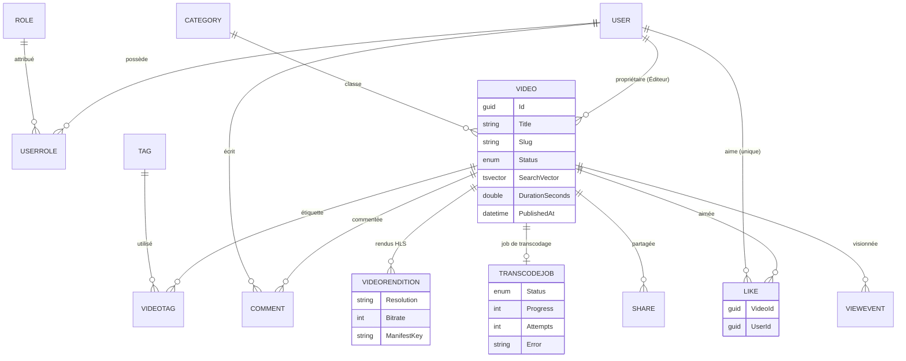

Entités complémentaires : **`AuditLog`** (traçabilité : acteur, action, entité, horodatage) et
**`SystemSetting`** (configuration clé/valeur). Contrainte forte : un **like est unique** par
couple (vidéo, utilisateur).

---

## 4. Téléversement (upload chunké)

Le fichier source est découpé côté navigateur en **tranches de 5 Mo** envoyées une à une. Chaque
chunk est stocké tel quel dans MinIO (`originals/{videoId}/parts/{index}`). La finalisation
vérifie que **toutes** les tranches sont présentes, puis enfile le transcodage.

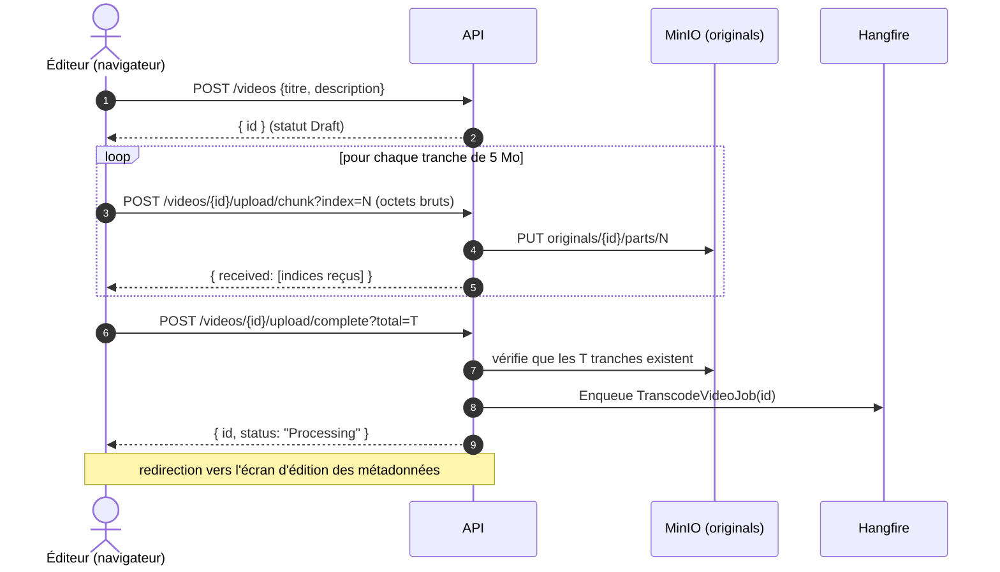

**Pourquoi par chunks ?** Robustesse (reprise possible), gros fichiers sans limite de requête,
et découplage de l'étape lourde (le transcodage) qui devient asynchrone.

| Écran de téléversement (Éditeur) |
|---|
| 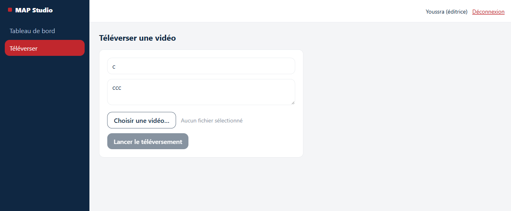 |

---

## 5. Encodeur vidéo & pipeline de transcodage

### 5.1 Principe

Le **worker** exécute `TranscodePipeline`, qui s'appuie sur **FFmpeg/ffprobe** (`FfmpegVideoTranscoder`).
Pour chaque vidéo, on génère un **HLS multi-débit** : plusieurs « échelons » (rungs) de qualité,
chacun avec sa playlist `.m3u8` et ses segments `.ts`, plus un **manifeste maître** qui les liste.

L'**échelle** est adaptative : on ne transcode **jamais au-dessus** de la résolution source
(pas d'upscaling), mais on garde toujours au moins le plus bas échelon.

| Échelon | Hauteur | Codecs | Usage |
|---|---|---|---|
| 360p | 360 | H.264 (main) + AAC | réseau lent / mobile |
| 720p | 720 | H.264 (main) + AAC | qualité standard |
| 1080p | 1080 | H.264 (main) + AAC | haute définition |

> Chaque échelon est encodé en `libx264 -profile:v main -preset veryfast`, audio `aac`,
> segments `-hls_time` (VOD). Le manifeste maître déclare `BANDWIDTH`, `RESOLUTION` et `CODECS`
> pour permettre au lecteur de choisir automatiquement la qualité (ABR).

### 5.2 Étapes du pipeline

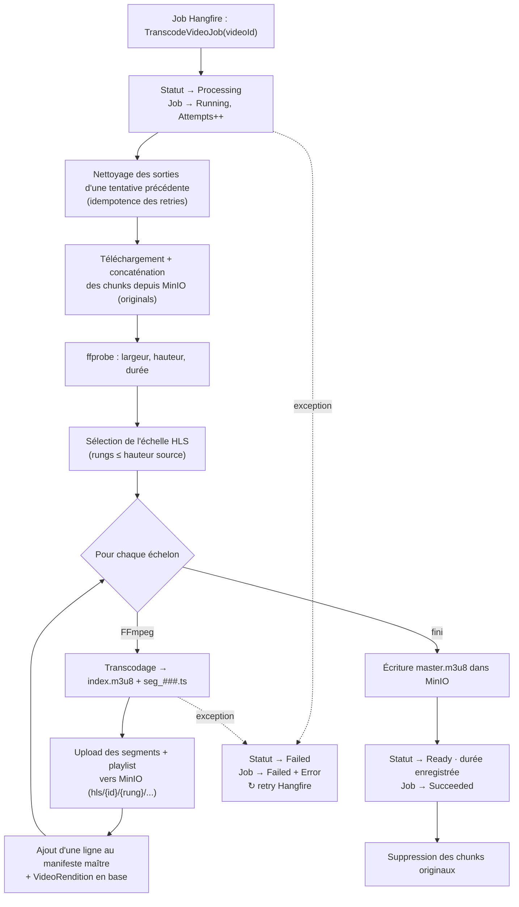

### 5.3 Arborescence MinIO produite

```
hls/{videoId}/
├── master.m3u8            ← manifeste maître (liste les échelons)
├── 360p/
│   ├── index.m3u8
│   └── seg_000.ts, seg_001.ts, …
├── 720p/
│   ├── index.m3u8
│   └── seg_000.ts, …
└── 1080p/
    ├── index.m3u8
    └── seg_000.ts, …
```

En cas d'échec, l'exception est relancée : **Hangfire** réessaie le job (idempotent grâce au
nettoyage initial), et la vidéo passe en **`Failed`** avec le message d'erreur enregistré.

---

## 6. Streaming HLS

### 6.1 Lecture adaptative

Le lecteur (**hls.js**, développé en interne) charge d'abord le **manifeste maître**, puis choisit
dynamiquement l'échelon adapté au débit réseau (ABR), et enchaîne le téléchargement des segments
`.ts`. Les segments ne sont **jamais servis en direct depuis MinIO** : ils passent par un **proxy**
de l'API qui applique le contrôle d'accès.

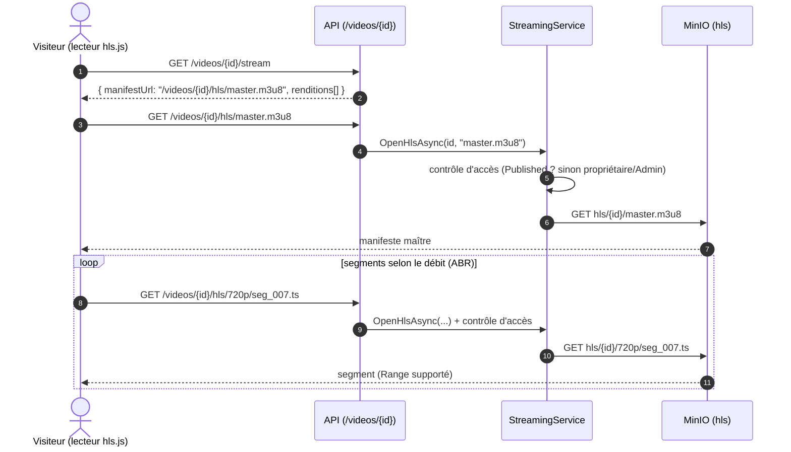

### 6.2 Sécurité du proxy

`StreamingService.OpenHlsAsync` :

- **rejette** les chemins suspects (`..`, chemin absolu) — protection contre la traversée ;
- **vérifie la visibilité** : une vidéo non `Published` n'est accessible qu'à son **propriétaire**
  ou à un **Admin** ; sinon `404` ;
- renvoie le bon `Content-Type` (`application/vnd.apple.mpegurl` pour `.m3u8`, `video/mp2t` pour `.ts`)
  et active le **support des Range requests** (seek/buffering).

---

## 7. Cycle de vie d'une vidéo (transversal)

Le statut d'une vidéo orchestre l'ensemble des composants (upload, transcodage, diffusion,
engagement). C'est l'axe **transversal** du système.

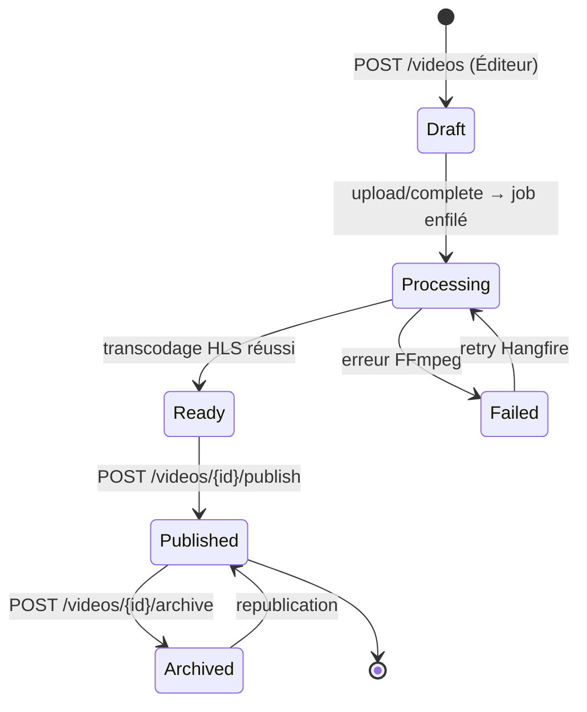

| Statut | Signification | Visible au catalogue public ? |
|---|---|---|
| **Draft** | Créée, fichier en cours de téléversement | Non |
| **Processing** | Transcodage en cours (worker FFmpeg) | Non |
| **Ready** | HLS prêt, publiable par l'éditeur | Non (propriétaire/Admin seulement) |
| **Published** | Diffusée | **Oui** |
| **Archived** | Retirée du catalogue | Non |
| **Failed** | Échec du pipeline (+ retry) | Non |

Le **`TranscodeJob`** suit ce cycle côté traitement (`Running → Succeeded`/`Failed`, `Attempts`,
`Error`), permettant à l'éditeur de suivre l'état dans son tableau de bord.

---

## 8. Commentaires & likes (engagement)

L'engagement (`EngagementService`) couvre **commentaires**, **likes** et **partages**. Règle
d'accès : le **visionnage est anonyme**, mais **commenter / liker / partager exige une
authentification** (`[Authorize]`). Toutes les opérations vérifient d'abord la **visibilité** de
la vidéo (publiée, ou propriétaire/Admin).

### 8.1 Ajout d'un commentaire

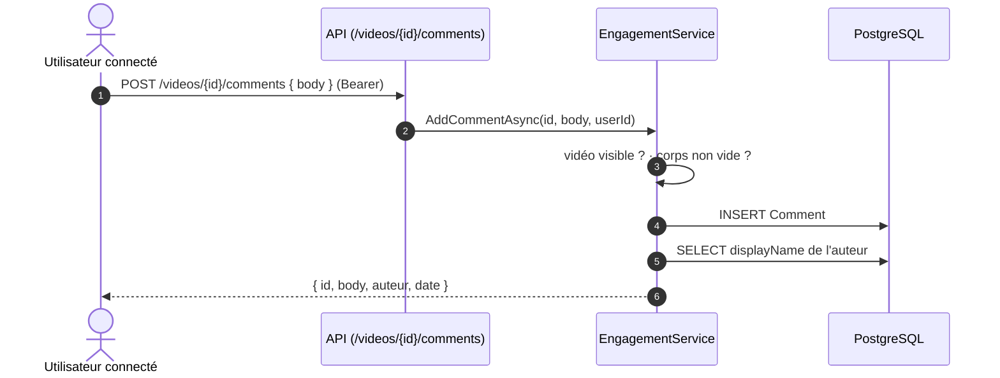

- **Liste** paginée (20 / page), triée par date décroissante, en **excluant** les commentaires
  modérés (`IsModerated`).
- **Suppression** : réservée à **l'auteur** du commentaire ou à un **Admin** (sinon `403`).

### 8.2 Like / Unlike (idempotent et unique)

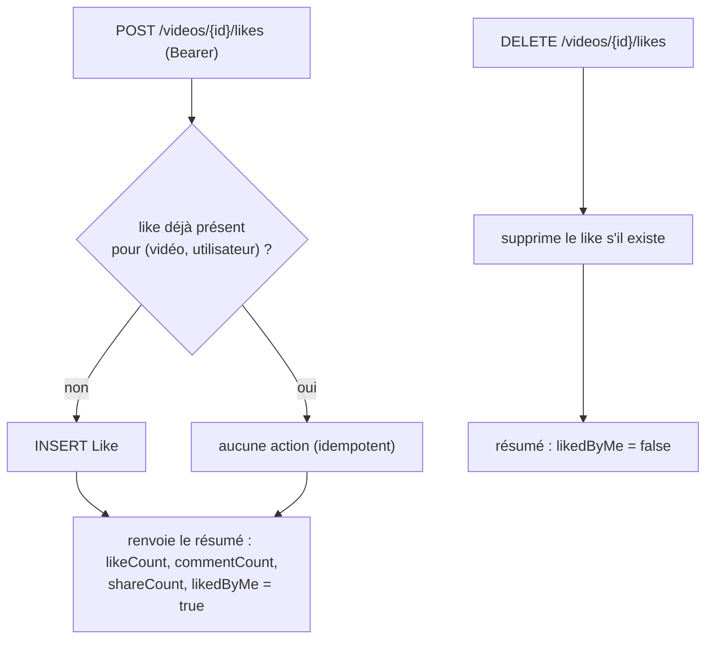

La contrainte d'**unicité (VideoId, UserId)** en base garantit qu'un utilisateur ne peut liker
qu'une fois. `GetSummaryAsync` renvoie les compteurs **et** l'indicateur `likedByMe` pour piloter
l'état du bouton côté UI. Les **partages** incrémentent un compteur par canal (`Channel`).

---

## 9. Accès : Admin, Éditeur, Visiteur

### 9.1 Modèle RBAC

L'authentification repose sur **ASP.NET Core Identity** (hachage du mot de passe) et un **JWT**
signé contenant l'identité et les **rôles**. Chaque requête protégée est filtrée par
`[Authorize(Roles=…)]` côté API, et par des **gardes** côté Angular.

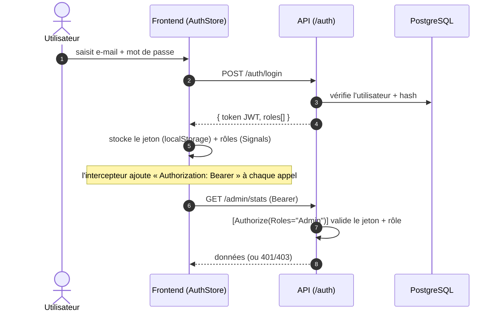

Côté frontend, le routage applique les gardes :

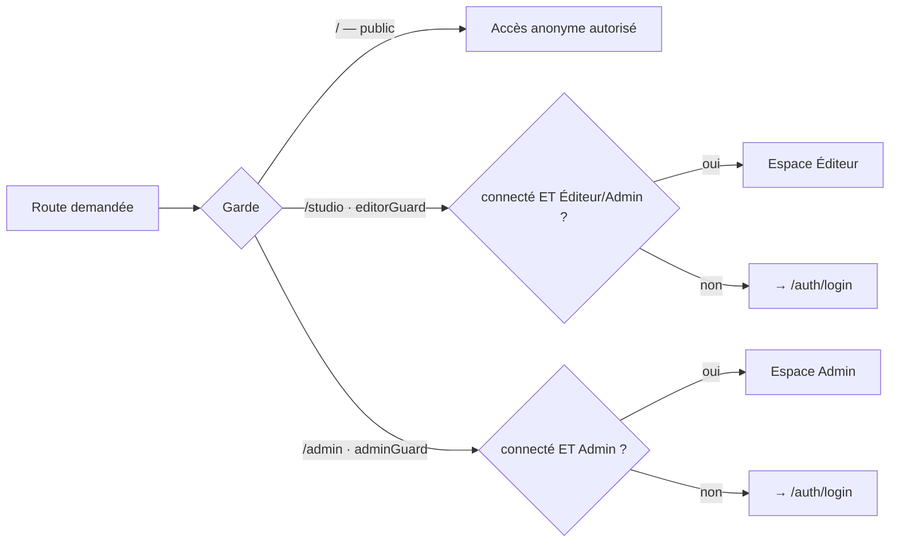

### 9.2 Capacités par rôle

| Capacité | Visiteur | Éditeur | Admin |
|---|:---:|:---:|:---:|
| Naviguer le catalogue, visionner (HLS) | ✅ (anonyme) | ✅ | ✅ |
| Commenter / liker / partager | 🔒 connecté | ✅ | ✅ |
| Téléverser une vidéo, éditer ses métadonnées | — | ✅ | ✅ |
| Publier / archiver une vidéo | — | ✅ (les siennes) | ✅ (toutes) |
| Voir « mes vidéos » + suivi de transcodage | — | ✅ | ✅ |
| Gérer les utilisateurs & rôles | — | — | ✅ |
| Gérer les catégories | — | — | ✅ |
| Statistiques globales (`/stats`) | — | — | ✅ |
| Journal d'audit (`/audit`) | — | — | ✅ |
| Configuration système (`/config`) | — | — | ✅ |

> Le compte **Administrateur** initial est créé automatiquement au démarrage de l'API (seed),
> puis l'Admin peut **promouvoir** d'autres comptes en Éditeur/Admin. Un nouvel inscrit reçoit
> par défaut le rôle **Visiteur**.

### 9.3 Espaces & coquilles

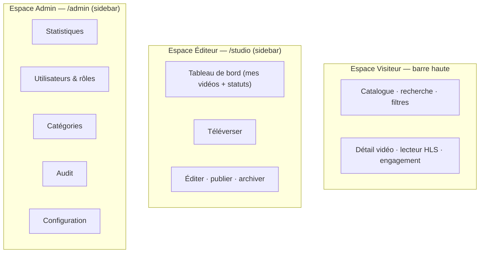

---

## 10. Déploiement

Orchestration via **Docker Compose** — pile 100 % auto-hébergée, aucun service externe.

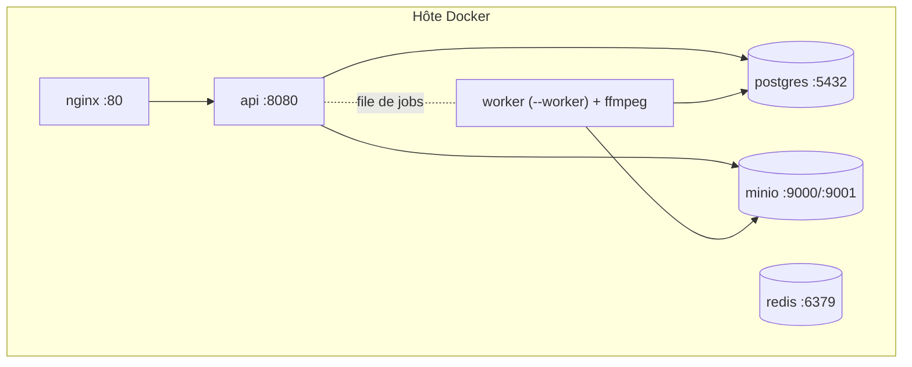

- **api** et **worker** partagent la même image (le runtime inclut **FFmpeg**) ; le worker démarre
  avec `--worker` et n'héberge que le serveur Hangfire.
- Au démarrage, l'API **applique les migrations** EF Core, **crée les buckets** MinIO et **initialise
  le compte administrateur**.
- La **vérification** repose sur des tests d'intégration à **conteneurs réels** (PostgreSQL + MinIO
  via Testcontainers) côté backend, et **Jest** côté frontend.

---

## 11. Annexe — référence des endpoints

Tous sous `/api/v1`. Erreurs normalisées via `ProblemDetails`.

| Domaine | Endpoints | Accès |
|---|---|---|
| **Auth** | `POST /auth/login` · `POST /auth/register` · `GET /auth/me` | Public / Bearer |
| **Catalogue** | `GET /videos` (q, categoryId, tag, page) · `GET /videos/{id}` | Anonyme |
| **Diffusion** | `GET /videos/{id}/stream` · `GET /videos/{id}/hls/{**path}` | Anonyme (si publiée) |
| **Édition** | `POST /videos` · `/upload/chunk` · `/upload/complete` · `PUT /videos/{id}` · `/publish` · `/archive` · `GET /videos/mine` | Éditeur |
| **Engagement** | `GET/POST/DELETE /videos/{id}/comments` · `POST/DELETE /videos/{id}/likes` · `POST /videos/{id}/shares` · `GET /videos/{id}/engagement` · `POST /videos/{id}/views` | Anonyme (lecture) / Connecté (écriture) |
| **Admin** | `GET /stats` · `GET /audit` · `GET/PUT /config` | Admin |
| **Utilisateurs** | `GET /users` · `PUT /users/{id}` · `POST /users/{id}/roles` · `DELETE /users/{id}/roles/{role}` | Admin |
| **Référentiels** | `GET /categories` · `POST/PUT/DELETE /categories/{id}` · `GET /tags` | Public (lecture) / Admin (écriture) |

---

*Document généré pour le Projet de Fin d'Études — Plateforme de diffusion vidéo MAP. Les figures
Mermaid et les schémas reflètent l'implémentation réelle (services, endpoints, pipeline) du dépôt.*
