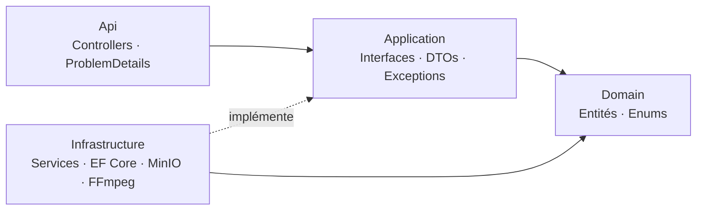
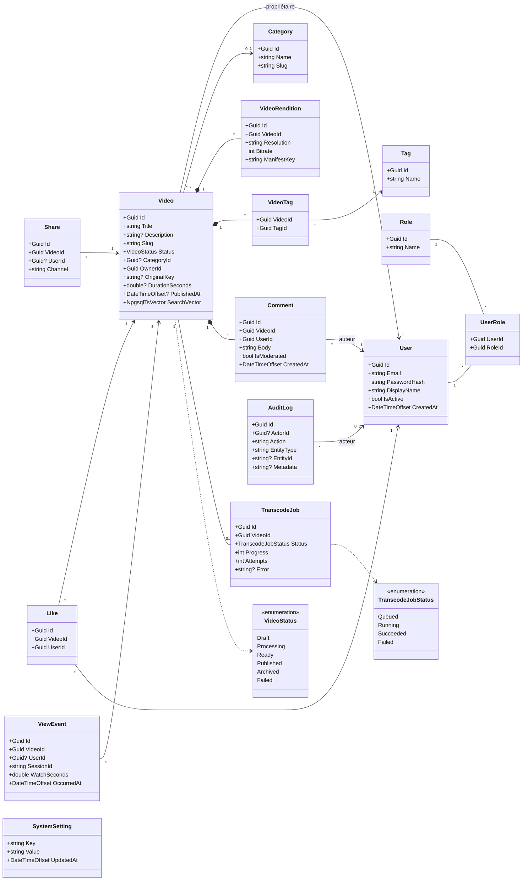
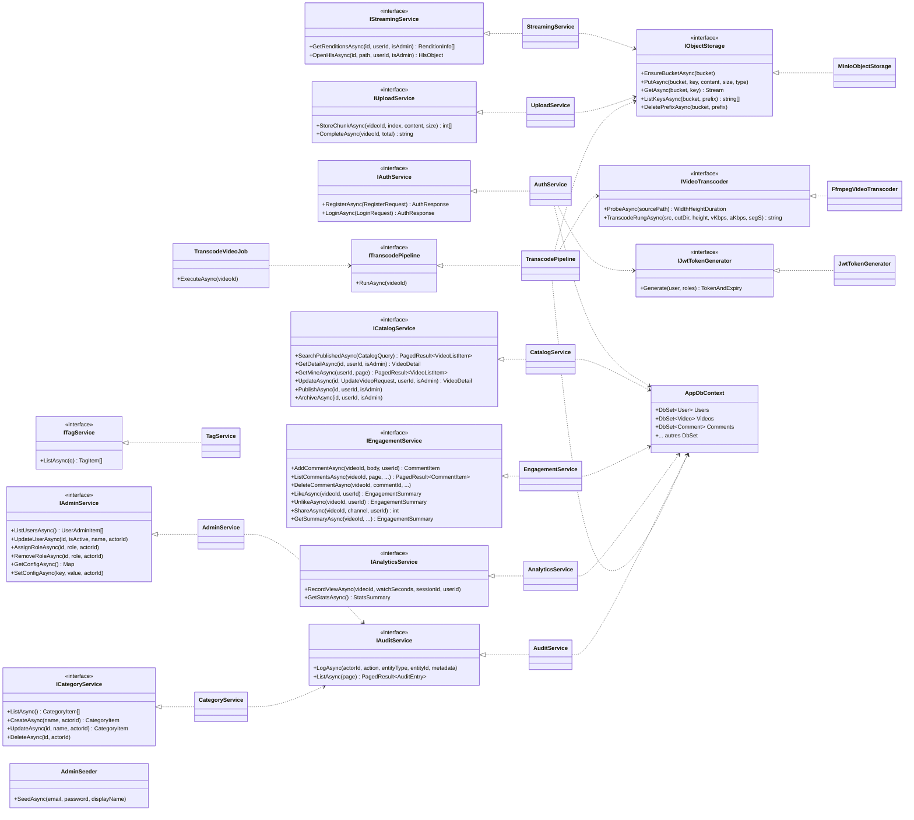
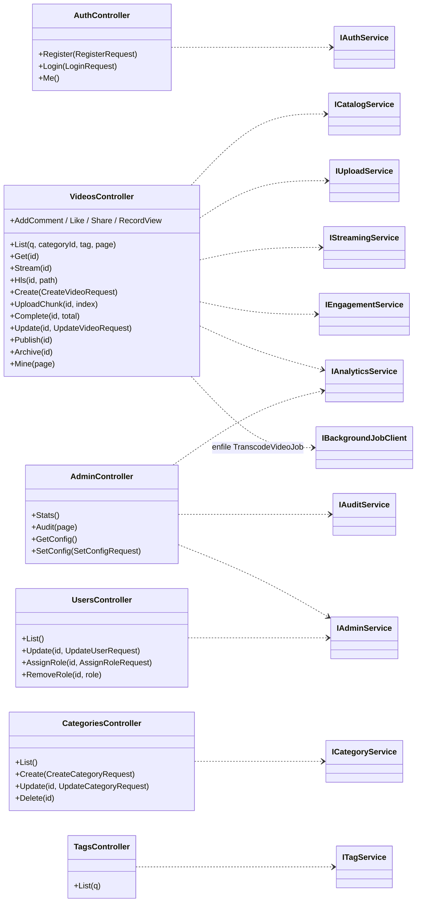
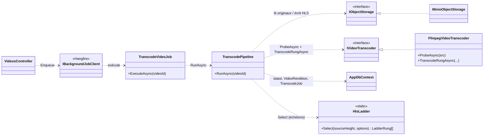

# Diagramme de classes — Backend (ASP.NET Core 8)

> Modélisation **fidèle au code** du backend de la plateforme vidéo MAP. Le backend suit une
> architecture en couches **Domain → Application → Infrastructure → Api**. Pour rester lisible,
> les classes sont présentées en **trois diagrammes** (Domaine, Services, API), chacun suivi
> d'explications détaillées.
>
> Les figures sont en **Mermaid** (`classDiagram`) : elles se rendent sur GitHub et dans VS Code
> (extension *Markdown Preview Mermaid Support*).

**Sommaire**

1. [Architecture en couches](#1-architecture-en-couches)
2. [Diagramme 1 — Domaine (entités & enums)](#2-diagramme-1--domaine-entités--enums)
3. [Diagramme 2 — Couche services (interfaces ↔ implémentations)](#3-diagramme-2--couche-services-interfaces--implémentations)
4. [Diagramme 3 — Couche API (controllers → services)](#4-diagramme-3--couche-api-controllers--services)
5. [Collaboration du pipeline de transcodage](#5-collaboration-du-pipeline-de-transcodage)
6. [Synthèse des responsabilités](#6-synthèse-des-responsabilités)

---

## 1. Architecture en couches

- **Domain** — entités métier (`User`, `Video`, `Comment`…) et enums (`VideoStatus`…). Aucune
  dépendance technique.
- **Application** — **contrats** (interfaces `I…Service`), **DTOs** et **exceptions** métier. Ne
  connaît que le Domaine.
- **Infrastructure** — **implémentations** concrètes : services, `AppDbContext` (EF Core),
  `MinioObjectStorage`, `FfmpegVideoTranscoder`, `JwtTokenGenerator`.
- **Api** — **contrôleurs minces** (controllers → services), configuration (JWT, Hangfire, Swagger).

> Règle de dépendance : le code dépend **vers l'intérieur** (Api → Application → Domain).
> L'Infrastructure **implémente** les interfaces de l'Application (inversion de dépendance).

---

## 2. Diagramme 1 — Domaine (entités & enums)

### Explication

**RBAC (rôles).** `User` et `Role` forment une relation **plusieurs-à-plusieurs** via la table
de jointure `UserRole`. Les rôles seedés sont **Admin / Editeur / Visiteur**. Le mot de passe
n'est jamais stocké en clair : seul `PasswordHash` (haché par ASP.NET Core Identity) est persisté.

**Agrégat `Video`.** C'est la racine du catalogue. Une vidéo :
- appartient à **un propriétaire** (`OwnerId` → `User`, l'éditeur) et **optionnellement** à une
  `Category` ;
- porte un **statut** (`VideoStatus`) qui pilote son cycle de vie
  (`Draft → Processing → Ready → Published → Archived`, + `Failed`) ;
- **compose** ses `VideoRendition` (les rendus HLS 360p/720p/1080p, avec `ManifestKey` = clé MinIO),
  ses `VideoTag` (vers `Tag`, en plusieurs-à-plusieurs) et ses `Comment` ;
- possède un `SearchVector` (`tsvector` PostgreSQL) pour la **recherche full-text** ;
- référence son fichier source via `OriginalKey` (clé MinIO).

**Traitement.** `TranscodeJob` suit l'avancement du transcodage (`Status` = `TranscodeJobStatus`,
`Progress`, `Attempts`, `Error`) — **un job par vidéo**.

**Engagement.** `Comment`, `Like`, `Share` et `ViewEvent` référencent une `Video` (et un `User`
quand l'auteur est authentifié). Un **`Like` est unique** par couple (`VideoId`, `UserId`) —
contrainte d'unicité en base. `ViewEvent` alimente l'analytique (vues, temps de visionnage).

**Administration.** `AuditLog` trace les actions sensibles (acteur, action, entité, horodatage),
et `SystemSetting` stocke la configuration **clé/valeur**.

> Les entités d'engagement (`Like`, `Share`, `ViewEvent`) n'ont pas de propriétés de navigation
> vers `Video`/`User` : elles sont reliées par **clés étrangères** (`VideoId`, `UserId`), ce qui
> garde le modèle léger pour des écritures fréquentes.

---

## 3. Diagramme 2 — Couche services (interfaces ↔ implémentations)

### Explication

Chaque domaine fonctionnel expose une **interface** (Application) et une **implémentation**
(Infrastructure), reliées par une **réalisation** (`<|..`). Les flèches en pointillés (`..>`)
sont des **dépendances** (injection).

| Interface | Implémentation | Dépendances clés | Rôle |
|---|---|---|---|
| `IAuthService` | `AuthService` | `AppDbContext`, `IPasswordHasher<User>`, `IJwtTokenGenerator` | Inscription, connexion, émission du JWT. |
| `ICatalogService` | `CatalogService` | `AppDbContext` | Recherche full-text, détail, « mes vidéos », publication/archivage. |
| `ICategoryService` / `ITagService` | `CategoryService` / `TagService` | `AppDbContext` (+ `IAuditService`) | Référentiels du catalogue. |
| `IUploadService` | `UploadService` | `IObjectStorage` | Réception des chunks, validation de complétude. |
| `IVideoTranscoder` | `FfmpegVideoTranscoder` | binaires `ffprobe`/`ffmpeg` | Sondage + encodage d'un échelon HLS. |
| `ITranscodePipeline` | `TranscodePipeline` | `AppDbContext`, `IObjectStorage`, `IVideoTranscoder` | Orchestration du transcodage de bout en bout. |
| `IObjectStorage` | `MinioObjectStorage` | client MinIO | Stockage objet (originaux + HLS). |
| `IStreamingService` | `StreamingService` | `AppDbContext`, `IObjectStorage` | Renditions + proxy HLS avec contrôle d'accès. |
| `IEngagementService` | `EngagementService` | `AppDbContext` | Commentaires, likes, partages, résumé. |
| `IAdminService` | `AdminService` | `AppDbContext`, `IAuditService` | Utilisateurs/rôles, configuration. |
| `IAnalyticsService` | `AnalyticsService` | `AppDbContext` | Télémétrie de visionnage, statistiques. |
| `IAuditService` | `AuditService` | `AppDbContext` | Journalisation des actions sensibles. |
| `IJwtTokenGenerator` | `JwtTokenGenerator` | `JwtOptions` | Génération du jeton signé. |

**Classes utilitaires :**
- **`TranscodeVideoJob`** — job **Hangfire** ; sa méthode `ExecuteAsync(videoId)` délègue à
  `ITranscodePipeline`. C'est le point d'entrée du transcodage asynchrone.
- **`AdminSeeder`** — crée les comptes administrateur au démarrage (idempotent).
- **`AppDbContext`** — contexte **EF Core** ; expose un `DbSet<T>` par entité et configure les
  index, contraintes d'unicité et le `tsvector`.

> Le découplage par interfaces permet de **tester** chaque service isolément et d'échanger une
> implémentation (ex. remplacer MinIO) sans toucher au reste.

---

## 4. Diagramme 3 — Couche API (controllers → services)

### Explication

Les contrôleurs sont **minces** : ils valident l'entrée, appellent un service, et traduisent les
exceptions métier en réponses HTTP normalisées (`ProblemDetails`). L'autorisation est déclarée par
attribut (`[Authorize(Roles="Admin")]`, `[Authorize(Roles="Editeur")]`…).

- **`AuthController`** → `IAuthService` (login/register/me).
- **`VideosController`** est le plus riche : il orchestre **catalogue** (`ICatalogService`),
  **upload** (`IUploadService` + `IBackgroundJobClient` pour enfiler le transcodage),
  **diffusion** (`IStreamingService`), **engagement** (`IEngagementService`) et **télémétrie**
  (`IAnalyticsService`).
- **`AdminController`** → stats/audit/config. **`UsersController`** → gestion des utilisateurs et
  rôles. **`CategoriesController`** / **`TagsController`** → référentiels.

> `VideosController` reçoit aussi `IBackgroundJobClient` (Hangfire) : à la finalisation d'un upload,
> il appelle `_jobs.Enqueue<TranscodeVideoJob>(j => j.ExecuteAsync(id))` — c'est le **pont** entre
> la requête HTTP synchrone et le traitement **asynchrone**.

---

## 5. Collaboration du pipeline de transcodage

Ce diagramme zoome sur les classes qui coopèrent lors du transcodage (le cœur métier le plus
complexe).

**Déroulé.** `VideosController.Complete` enfile un `TranscodeVideoJob` via Hangfire. Le worker
l'exécute → `TranscodePipeline.RunAsync` : il télécharge les chunks depuis MinIO (`IObjectStorage`),
sonde la source et choisit les échelons (`HlsLadder.Select`), transcode chaque échelon
(`IVideoTranscoder` = `FfmpegVideoTranscoder`), réécrit les segments + playlists dans MinIO,
enregistre les `VideoRendition` et met la vidéo en `Ready` (ou `Failed` + retry) via `AppDbContext`.

---

## 6. Synthèse des responsabilités

| Couche | Classes types | Responsabilité |
|---|---|---|
| **Domain** | `User`, `Video`, `Comment`, `TranscodeJob`, `VideoStatus`… | Modèle métier et règles invariantes ; aucune dépendance technique. |
| **Application** | `I…Service`, DTOs (`VideoDetail`, `StatsSummary`…), exceptions | Contrats et formes d'échange ; orchestration logique. |
| **Infrastructure** | `…Service`, `AppDbContext`, `MinioObjectStorage`, `FfmpegVideoTranscoder`, `JwtTokenGenerator` | Implémentations concrètes (DB, stockage, FFmpeg, JWT). |
| **Api** | `…Controller`, configuration | Exposition HTTP, sécurité par rôle, normalisation des erreurs. |

**Principes appliqués :**
- **Inversion de dépendance** : l'Infrastructure dépend des interfaces de l'Application, pas l'inverse.
- **Responsabilité unique** : un service par domaine fonctionnel (auth, catalogue, engagement…).
- **Asynchronisme** : les I/O (DB, MinIO, FFmpeg) sont `async/await` ; le transcodage lourd est
  déporté dans une file Hangfire.
- **Sécurité** : RBAC par `[Authorize(Roles=…)]`, mots de passe hachés, proxy HLS contrôlé.

---

*Document basé sur l'implémentation réelle des entités, interfaces, services et contrôleurs du
dépôt (`backend/src`).*
