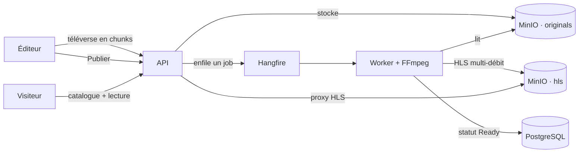
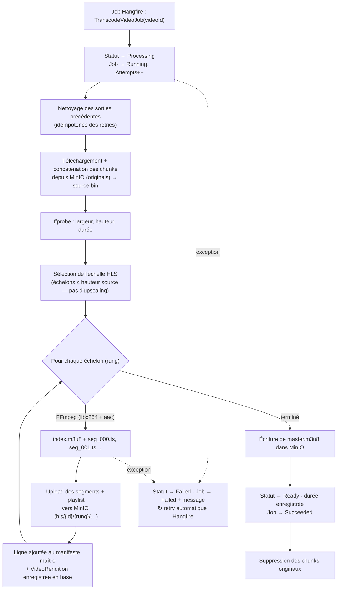
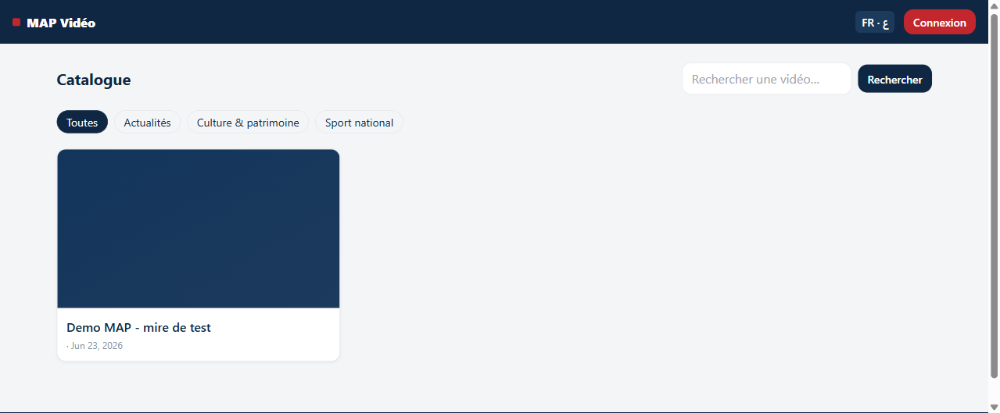
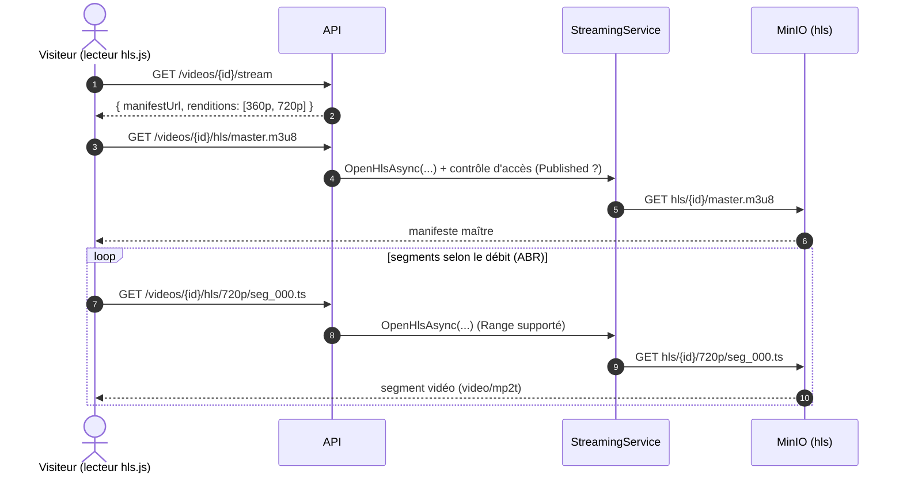
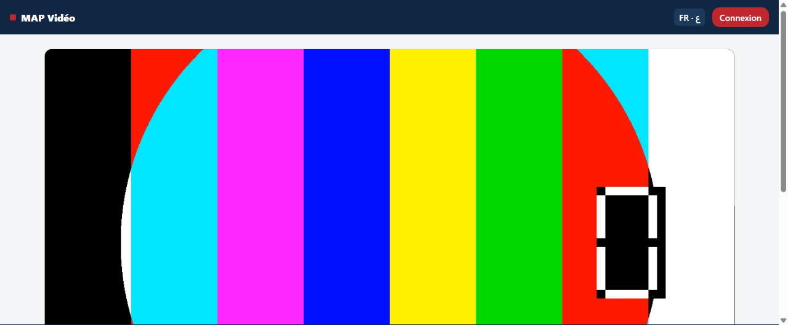
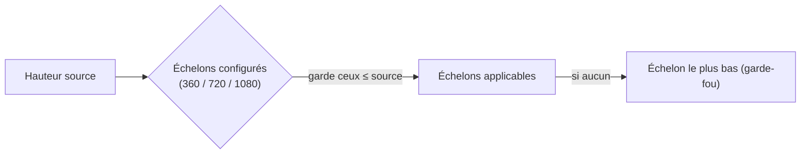
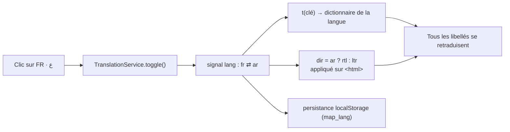

# Transcodage, diffusion et rôles — Plateforme vidéo MAP

> Ce document décrit, **tel qu'implémenté**, le fonctionnement du **transcodage vidéo**
> (worker + FFmpeg → HLS), le flux de **publication et de diffusion** jusqu'à la
> **consommation** par le visiteur, les **tâches de chaque profil** (Admin, Éditeur,
> Visiteur), puis deux sections techniques dédiées à **FFmpeg** et à l'**internationalisation
> (i18n FR/AR + RTL)**.
>
> Les captures proviennent d'une **démonstration réelle** de bout en bout : une vidéo a été
> générée, téléversée, transcodée, publiée, puis **lue dans le navigateur**.

---

## 1. Vue d'ensemble du flux



Le **téléversement** et la **lecture** sont synchrones (HTTP), tandis que le **transcodage**
(lourd) est **asynchrone** : il est déporté dans une file Hangfire exécutée par un **worker**
dédié embarquant **FFmpeg**.

---

## 2. Le transcodage : worker + FFmpeg → HLS

### 2.1 Déclenchement

Quand l'éditeur **finalise** le téléversement (`POST /videos/{id}/upload/complete`), l'API :

1. passe la vidéo en **`Processing`** ;
2. enfile un job **Hangfire** `TranscodeVideoJob(videoId)`.

Le **worker** (conteneur séparé, lancé avec `--worker`) consomme ce job et exécute
`TranscodePipeline.RunAsync`.

### 2.2 Étapes du pipeline



### 2.3 Résultat de la démonstration réelle

Une mire de test **720p / 5 s** a été générée, téléversée puis transcodée. Résultat **mesuré** :

| Étape | Valeur observée |
|---|---|
| Statut après `complete` | `Processing` |
| Durée du transcodage | **≈ 2 secondes** → `Ready` |
| Échelons générés (source 720p) | **360p** (800 kbps) **+ 720p** (2500 kbps) |
| 1080p | **non généré** (pas d'upscaling au-dessus de la source) |
| Segment `720p/seg_000.ts` servi | HTTP 200 · `video/mp2t` · **523 Ko** |

> Le choix des échelons est **adaptatif** : on ne transcode jamais au‑dessus de la résolution
> source. Une source 720p produit donc 360p + 720p ; une source 1080p produirait les trois.

### 2.4 Arborescence HLS produite dans MinIO

```
hls/{videoId}/
├── master.m3u8          ← manifeste maître (liste les échelons + débits)
├── 360p/
│   ├── index.m3u8
│   └── seg_000.ts, seg_001.ts, …
└── 720p/
    ├── index.m3u8
    └── seg_000.ts, …
```

Manifeste maître réellement généré pour la démo :

```m3u8
#EXTM3U
#EXT-X-VERSION:3
#EXT-X-STREAM-INF:BANDWIDTH=896000,RESOLUTION=640x360,CODECS="avc1.640028,mp4a.40.2"
360p/index.m3u8
#EXT-X-STREAM-INF:BANDWIDTH=2628000,RESOLUTION=1280x720,CODECS="avc1.640028,mp4a.40.2"
720p/index.m3u8
```

| Écran de téléversement (Éditeur) — point de départ du pipeline |
|---|
|  |

---

## 3. Publication & diffusion, jusqu'à la consommation

### 3.1 Publication

Une fois la vidéo **`Ready`**, l'éditeur clique **« Publier »** (`POST /videos/{id}/publish`).
La règle métier : **on ne peut publier que depuis l'état `Ready` ou `Archived`** ; sinon l'API
renvoie `409` avec le motif exact. Après publication, la vidéo passe en **`Published`** et
apparaît au **catalogue public**.

### 3.2 La vidéo apparaît au catalogue (anonyme)



### 3.3 Diffusion HLS adaptative (ABR) jusqu'à la lecture

Le lecteur interne **hls.js** charge d'abord le **manifeste maître**, choisit dynamiquement
l'échelon adapté au débit réseau, puis enchaîne les segments `.ts`. **Aucun segment n'est servi
en direct depuis MinIO** : tout passe par un **proxy** de l'API qui applique le contrôle d'accès.



### 3.4 Consommation : la vidéo se lit dans le navigateur

Résultat final de la démonstration — la mire transcodée **jouée dans le lecteur HLS interne** :



> **Vérifié de bout en bout :** génération → upload chunké → transcodage HLS (360p+720p) →
> publication → catalogue public → **lecture dans le navigateur**, avec de vraies données,
> sans aucune simulation.

---

## 4. Tâches par profil

> [!NOTE]
> ### 👑 Administrateur
> - **Utilisateurs & rôles** : lister, activer/désactiver, attribuer/retirer les rôles
>   (Visiteur, Éditeur, Admin).
> - **Catégories** : créer, renommer, supprimer (référentiel du catalogue).
> - **Statistiques globales** : nombre de vidéos, d'utilisateurs, de vues, temps de visionnage,
>   top contenus.
> - **Journal d'audit** : traçabilité des actions sensibles (qui a fait quoi, quand).
> - **Configuration système** : paramètres clé/valeur.
> - *(Hérite aussi des capacités de l'Éditeur sur **toutes** les vidéos.)*

> [!NOTE]
> ### 🎬 Éditeur
> - **Téléverser** une vidéo (upload chunké) et suivre son **transcodage** (statut).
> - **Éditer les métadonnées** : titre, description, catégorie, tags.
> - **Publier** (depuis `Ready`/`Archived`) et **archiver** (depuis `Published`) **ses** vidéos.
> - Consulter **« Mes vidéos »** avec leur statut (Draft → Processing → Ready → Published → Archived).
> - Recherche / indexation du catalogue.

> [!NOTE]
> ### 👁️ Visiteur
> - **Naviguer** le catalogue public (recherche `?q=`, filtres par catégorie/tag, pagination).
> - **Visionner** les vidéos publiées en streaming HLS (**visionnage anonyme autorisé**).
> - **S'inscrire / se connecter** (auto-inscription).
> - Une fois **authentifié** : **commenter**, **liker**, **partager**.

---

## 5. Section technique — FFmpeg

Le transcodage repose sur les binaires **ffprobe** (sondage) et **ffmpeg** (ré-encodage),
présents dans l'image du worker. Implémentation : `FfmpegVideoTranscoder`.

### 5.1 Sondage (ffprobe)

```bash
# Largeur / hauteur du flux vidéo
ffprobe -v error -select_streams v:0 -show_entries stream=width,height -of csv=p=0  source
# Durée
ffprobe -v error -show_entries format=duration -of csv=p=0  source
```

La **hauteur** détermine quels échelons générer ; la **durée** est enregistrée sur la vidéo.

### 5.2 Encodage d'un échelon (ffmpeg)

Exemple réel pour l'échelon **720p** :

```bash
ffmpeg -y -i source \
  -vf scale=-2:720 \
  -c:v libx264 -profile:v main -preset veryfast \
  -b:v 2500k -maxrate 2675k -bufsize 5000k \
  -c:a aac -b:a 128k \
  -hls_time <S> -hls_playlist_type vod \
  -hls_segment_filename "720p/seg_%03d.ts" \
  "720p/index.m3u8"
```

| Option | Rôle |
|---|---|
| `-vf scale=-2:720` | redimensionne à 720 px de haut, largeur auto **paire** (`-2`) en conservant le ratio. |
| `-c:v libx264 -profile:v main` | vidéo **H.264** (profil *main*), large compatibilité navigateur. |
| `-preset veryfast` | compromis vitesse/taille de l'encodage. |
| `-b:v / -maxrate / -bufsize` | débit cible, plafond (≈ +7 %) et tampon (= 2× le débit) pour un **CBR souple**. |
| `-c:a aac -b:a 128k` | audio **AAC**. |
| `-hls_time` + `-hls_playlist_type vod` | **segmentation HLS** en VOD. |
| `-hls_segment_filename` + playlist | écrit `seg_###.ts` et la playlist `index.m3u8` de l'échelon. |

### 5.3 Échelle adaptative (pas d'upscaling)



Échelons (valeurs observées) :

| Échelon | Hauteur | Vidéo | Audio | maxrate | bufsize |
|---|---|---|---|---|---|
| 360p | 360 | 800 kbps | 96 kbps | 856 kbps | 1600 kbps |
| 720p | 720 | 2500 kbps | 128 kbps | 2675 kbps | 5000 kbps |
| 1080p | 1080 | (selon configuration) | — | — | — |

Enfin, un **manifeste maître** liste chaque échelon avec `BANDWIDTH`, `RESOLUTION` et `CODECS`,
ce qui permet au lecteur de **basculer automatiquement** de qualité (ABR).

> **Note de version.** L'image embarque actuellement **FFmpeg 5.1** (paquet Debian) ; la
> spécification mentionne FFmpeg 6. Fonctionnellement équivalent pour ce pipeline ; à figer
> dans le Dockerfile si la cohérence de version est requise.

---

## 6. Section technique — Internationalisation (i18n FR/AR + RTL)

L'interface est **bilingue Français / Arabe** avec **bascule à chaud** et mise en page **RTL**
pour l'arabe, **sans aucune dépendance externe** (solution maison basée sur les **Signals**).

### 6.1 Composants

| Élément | Rôle |
|---|---|
| `TranslationService` | détient la langue active (`fr`/`ar`), calcule la **direction** (`ltr`/`rtl`), expose `t(clé)` à partir des dictionnaires, **persiste** le choix (`localStorage`) et applique `dir`/`lang` sur `<html>`. |
| `translations.ts` | dictionnaires **FR** et **AR** (`Record<string,string>`). |
| Pipe `\| t` | pipe **impur** qui traduit une clé dans les templates ; se réévalue à la bascule. |

### 6.2 Fonctionnement de la bascule



- À chaque clic, le signal `lang` change → **tous** les `{{ 'clé' | t }}` se retraduisent, et
  `<html dir>` bascule en **RTL** pour l'arabe.
- Le choix est **restauré au démarrage** depuis `localStorage`.
- La mise en page se **reflète** grâce aux **propriétés logiques** Tailwind (`ms-`/`me-` plutôt
  que `ml`/`mr`), donc les marges/positions s'inversent automatiquement en RTL.

### 6.3 Rendu réel

| Français (LTR) | Arabe (RTL — mise en page miroir) |
|---|---|
|  |  |

En arabe, on observe l'inversion complète : logo passé à droite, bouton de connexion à gauche,
titres alignés à droite, et libellés traduits (« الفهرس » = Catalogue, « تسجيل الدخول » = Connexion).

---

*Document basé sur l'implémentation réelle (services, pipeline, endpoints) et sur une
démonstration de bout en bout exécutée sur la pile auto‑hébergée (PostgreSQL + MinIO + Hangfire
+ FFmpeg + Nginx).*
